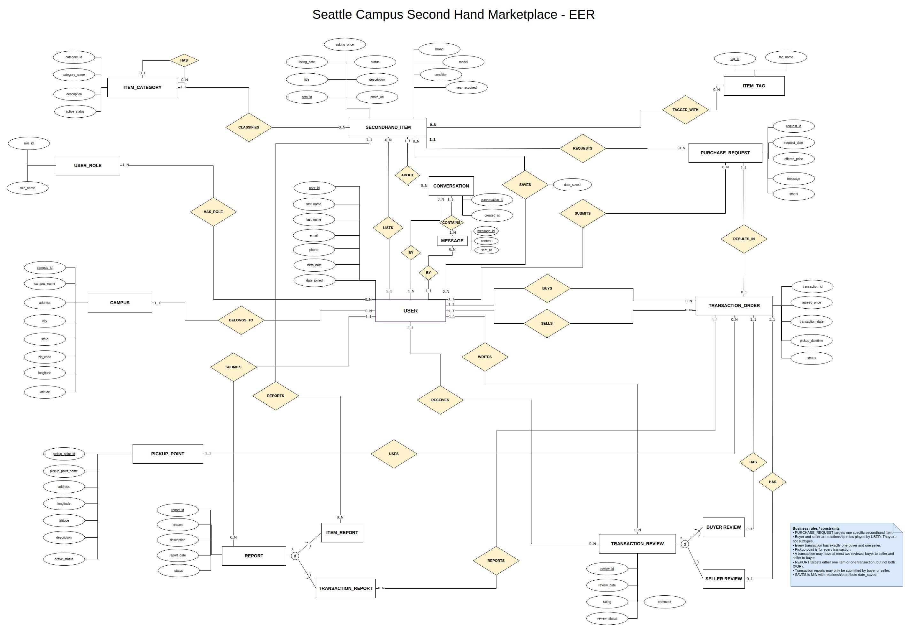
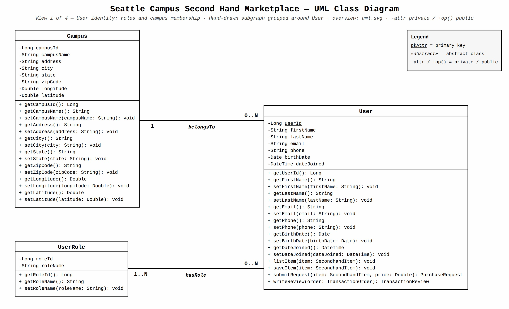
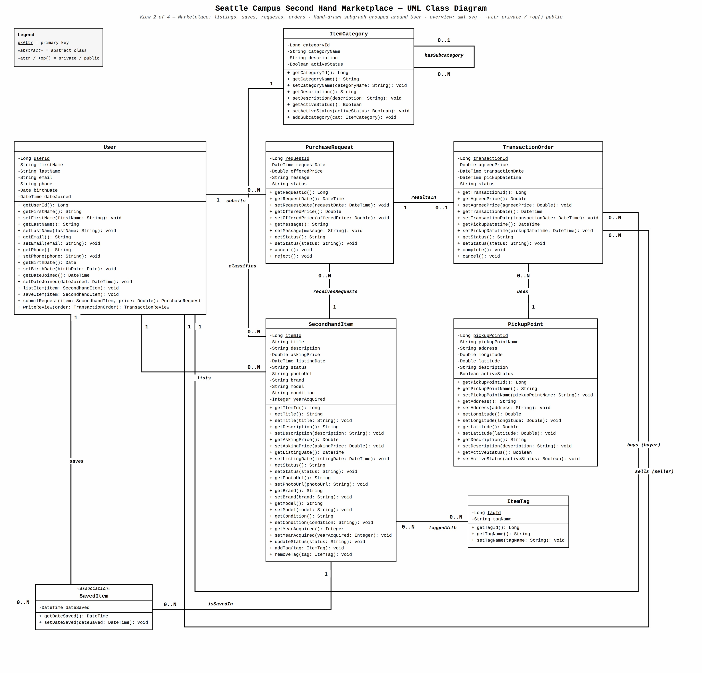
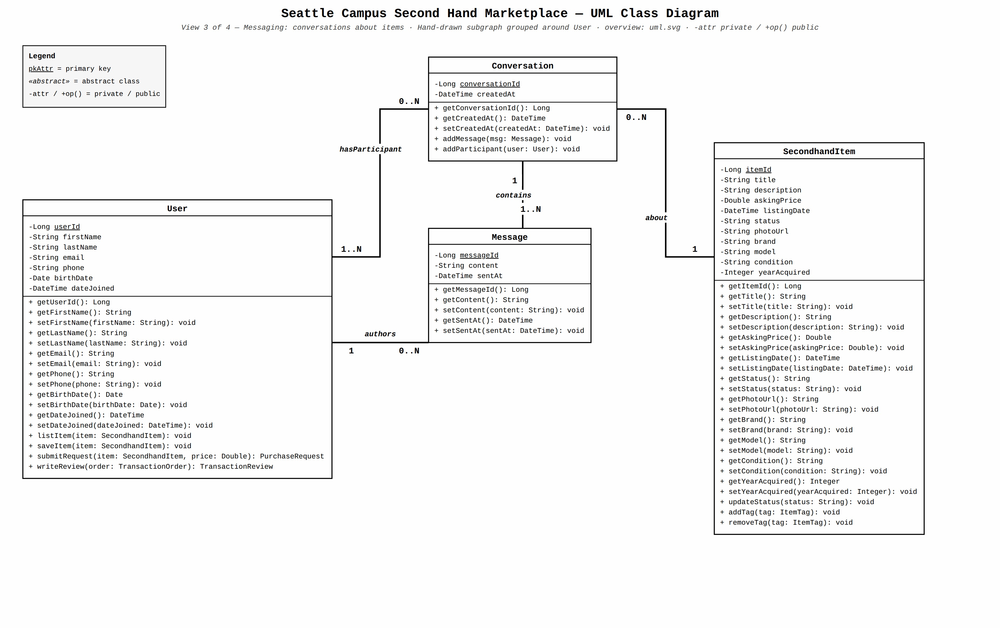
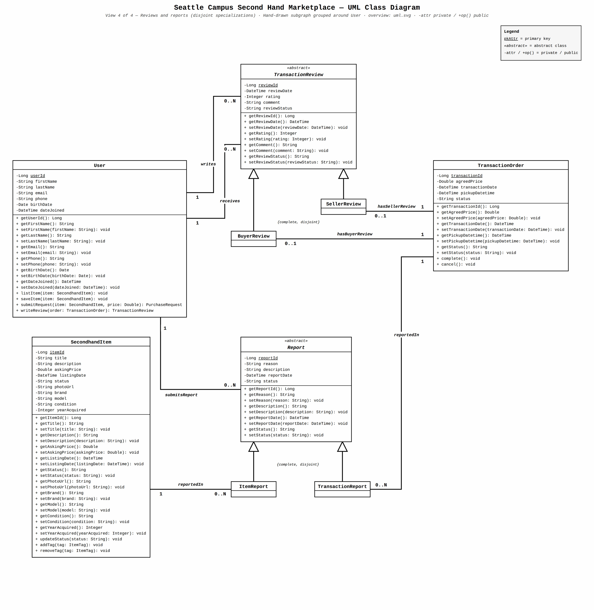

# Campus Secondhand Marketplace: EER and Class Diagram Design Overview

This design project models secondhand trading among students at Seattle-area universities. Students use one account to list items, browse listings, and buy from other students. Buyers and sellers communicate through the platform and arrange an in-person exchange; the platform records their agreement but does not process online payments. This article first explains the EER diagram as a data model, then presents the business objects and their relationships in four class diagrams, and finally outlines the user cases behind the design. Relationships shown in the diagrams are distinguished from business rules that still require implementation.

## 1. EER Diagram

### Design Overview

**Users and campuses.** Each `USER` belongs to one `CAMPUS` and receives roles through a many-to-many relationship with `USER_ROLE`. The same person can be a buyer in one order and a seller in another without maintaining separate profiles; the buyer and seller relationships on each order define the roles in that transaction. Implementation must also ensure that a new user has a valid campus and at least one role, and that administrative actions are authorized by role.

**Item discovery and saved items.** A user lists each `SECONDHAND_ITEM` under one `ITEM_CATEGORY`; categories can form a parent-child hierarchy. Items have a many-to-many relationship with `ITEM_TAG` for additional search attributes. The `SAVES` relationship between a user and an item stores `date_saved`, so saving an item is more than incrementing a counter. Categories support navigation, tags describe items, and saved-item records capture individual interests. Duplicate saves, duplicate item-tag pairs, and category cycles must be prevented in implementation.

**Purchase requests and orders.** A `PURCHASE_REQUEST` concerns a specific item and may include a buyer's offer. An item can receive multiple requests, but each request can produce at most one `TRANSACTION_ORDER`. The item's `asking_price`, the request's `offered_price`, and the order's `agreed_price` retain the listing price, offer, and agreed price separately. An order identifies its buyer, seller, and `PICKUP_POINT`; the pickup time belongs to the order, while location details can be reused. A request alone does not reserve an item. Once an order is agreed upon, it reserves the item and the remaining requests are rejected. Canceling that order reopens the item to new requests but does not automatically reinstate rejected ones. Only the seller can confirm completion after the in-person exchange, and that confirmation does not mean the platform has verified payment. These state transitions, the prevention of multiple active orders for one item, the prohibition on self-transactions, and the requirement that the order's buyer and seller match the requester and listing owner still need business-logic and persistence constraints. The diagram also does not yet model ownership of a seller's saved pickup locations or how the parties enter a new address; existing pickup points must not be interpreted as a mandatory platform-wide list.

**Conversations and messages.** A `CONVERSATION` is associated with an item and has participating users. Each `MESSAGE` records its conversation, sender, content, and time. Modeling participation separately from sending preserves both the discussion context and the author of each message; the sender must be a participant. The current diagram requires at least one message per conversation. If empty conversations should be allowed, the creation flow or cardinality needs to change. Application logic must also govern access to message history and prevent new messages after the item is taken down, an account is suspended, or the relevant order is completed.

**Reviews and reports.** `TRANSACTION_REVIEW` stores a rating, comment, and status. Its mutually exclusive `BUYER REVIEW` and `SELLER REVIEW` subtypes refer to the person being reviewed, not the author; an order can have at most one review of each type. `REPORT` stores the report content and processing status, while the mutually exclusive `ITEM_REPORT` and `TRANSACTION_REPORT` subtypes identify its single target. Only the two parties to a completed order may review each other, and only its buyer or seller may report that transaction. These cross-entity eligibility checks cannot be guaranteed by diagram relationships alone. Handling a report should preserve the original submission for auditing.

## 2. Class Diagrams

The complete class model spans identity, listings and orders, messaging, and platform moderation. A single image would be difficult to read, so it is divided into four connected areas. `User`, `SecondhandItem`, and `TransactionOrder`, where repeated across diagrams, refer to the same business objects, not separate datasets.

### 2.1 User Identity and Campus Affiliation

`User` stores an ID, name, email, phone number, date of birth, and join date. `Campus` stores its name, address, and location details, while `UserRole` describes a role. Every user belongs to one campus, and a campus may have many users. Every user has at least one role, and a role may be assigned to many users. Separating roles from profiles lets a student both buy and sell while also providing a basis for administrator permissions. This diagram models identity and campus affiliation, not the campus-email authentication flow itself. Access to contact details and birth dates requires controls. A personal activity view must aggregate listings, requests, orders, saved items, and reviews from the other diagrams.

### 2.2 Listings, Saved Items, Purchase Requests, and Orders

`SecondhandItem` stores listing details such as title, description, asking price, status, images, and condition. One `User` lists the item under one `ItemCategory`; categories may be hierarchical, and items can have many `ItemTag` entries. `SavedItem` links a user to an item and stores `dateSaved`; the same user should not save the same item twice. `PurchaseRequest` captures an offer, message, and processing status for a particular item. One item may receive multiple requests.

`TransactionOrder` originates from one request, identifies a buyer, seller, and `PickupPoint`, and records the agreed price, pickup time, and order status. A request can lead to at most one order. Creating an order requires checking that the participants, item, and request agree and that an item cannot have multiple active orders. The pickup-point class stores a name, address, coordinates, and active status, but does not yet represent ownership of a seller's frequently used locations or the entry of a new address. Reserving an item, reopening it after cancellation, and confirming completion by the seller likewise require business rules beyond the class associations. Neither an order nor a pickup location implies that an online payment has occurred.

### 2.3 Item Conversations and Messages

`Conversation` relates one `SecondhandItem` to its participating `User` accounts; an item can have multiple conversations. Each `Message` belongs to one conversation, has one sender, and records text and a timestamp. Organizing conversations by item keeps discussions about different listings separate, while message and participation relationships preserve authorship and context. The diagram requires at least one message per conversation; permitting an empty conversation would require changing that constraint. The application must restrict sending to participants, retain and allow access to message history, and block further messages when an item is taken down, a participant is suspended, or the corresponding order is completed.

### 2.4 Transaction Reviews and Reports

The abstract `TransactionReview` class holds a rating, comment, date, and status, and associates each review with an author and recipient. `BuyerReview` and `SellerReview` are complete and disjoint subtypes: they review the order's buyer and seller, respectively. An order has at most one review of each type. Submission is allowed only after the order is completed and only when the author and recipient are the two parties to that order.

The abstract `Report` class holds the reporting user, reason, description, date, and processing status. Its complete and disjoint `ItemReport` and `TransactionReport` subtypes target one item or one order, respectively; either target can receive multiple reports. A transaction report requires the reporter to be a party to that order. Administrator review and action, the reporter's access to their records, and restrictions on access by the reported user are business and authorization rules, not consequences of inheritance alone.

## 3. User Cases Informing the Design

The participants are students, students acting as buyers or sellers in particular transactions, and platform administrators. After signing in with a campus email address, students may browse and buy items across campuses; a cross-campus order triggers a notice, not a purchasing restriction. The following identifiers distinguish participants and business areas; a student does not need separate accounts for buying and selling.

### 3.1 All Students

- **UC-1101 Sign in with a campus email:** A student verifies their identity through a campus email address and is associated with a campus. Roles determine access to administrative functions. The identity diagram represents users, campuses, and roles, not the authentication flow.
- **UC-1102 View personal transaction history:** A student views their listings, requests, purchase and sale orders, saved items, and reviews written or received in one place. This view draws on multiple design areas.
- **UC-1501 Report an item or transaction:** A student may report an inappropriate item; only the buyer or seller of an order may report that transaction. A report has one target. Reporters can view their own submissions, reported users cannot see reports filed against them, and administrators can review and handle reports.

### 3.2 Buyers

- **UC-2201 Browse and filter items:** A buyer searches by category, price, campus, and tags, and views descriptions, images, condition, asking price, and visibility status. Items on other campuses are also available to browse.
- **UC-2202 Save an item:** A buyer saves or unsaves an item and can find it again in their personal list; the same item must not appear twice for that user.
- **UC-2401 Submit a purchase request:** A buyer offers a price and leaves a message about a specific item, then follows the request's status. Multiple buyers may request the same item; a request does not reserve it.

### 3.3 Sellers

- **UC-3201 List a secondhand item:** A seller enters a title, description, asking price, condition, and images, chooses a category, and may add a brand, model, and tags. Each item has an identified seller.
- **UC-3202 Manage listed items:** A seller checks item status and updates items that are still available. An item that is no longer for sale must not accept new valid requests.
- **UC-3401 Handle purchase requests:** A seller reviews and negotiates incoming requests. Once an order is agreed upon with one buyer, the item is reserved, other requests are rejected, and no other active order may be formed for that item.
- **UC-3402 Save frequently used pickup locations:** A seller saves personal pickup locations for reuse. These belong to the seller, and both parties can still agree on a new address; the current diagrams do not fully model this capability.
- **UC-3403 Confirm order completion:** After the parties arrange payment and exchange the item offline, the seller confirms completion. The platform does not verify payment.

### 3.4 Buyers and Sellers Together

- **UC-4301 Discuss an item:** The parties use a conversation about a specific item to discuss its condition, price, and exchange. Only participants can send messages. History remains available even without an order; when the item is taken down, either participant is suspended, or the corresponding order is completed, they can still read the history but can no longer send messages.
- **UC-4401 Agree on an order and pickup:** The parties agree on a price, time, and address based on a purchase request. The seller can choose a personal saved location or enter a new address; the final address is sent to their item conversation. Both parties can see the order, and cross-campus transactions only trigger a notice. Each request can form at most one order, and the buyer and seller cannot be the same person.
- **UC-4402 Follow up on an offline exchange:** Both parties view the order and pickup arrangements and handle payment and exchange offline. The order is neither completed nor eligible for post-transaction reviews until the seller confirms completion.
- **UC-4403 Cancel an order:** Either party can cancel. Releasing the item's reservation allows new requests, but previously rejected requests are not automatically restored.
- **UC-4501 Review the other party:** Once an order is completed, the buyer may review the seller and the seller may review the buyer. Each direction allows at most one review per order; unrelated users cannot be reviewed.

### 3.5 Platform Administrators

- **UC-5201 Maintain categories and tags:** An administrator manages the category hierarchy, tags, and their active status so listings and searches use consistent classifications.
- **UC-5501 Handle reports and prohibited content:** An administrator investigates item or transaction reports, records an outcome, and may remove an item, close a transaction, or suspend an offending user while preserving the original report.
- **UC-5601 View platform activity:** An administrator views summaries of listings, transactions, and user activity. The diagrams do not yet define how these metrics are calculated.

Together, these user cases define the workflows served by the diagrams' data relationships. Order reservations and cancellations, ownership of pickup locations, messaging restrictions, review eligibility, and reporting permissions still require implementation; static EER and class diagrams alone cannot enforce them.
