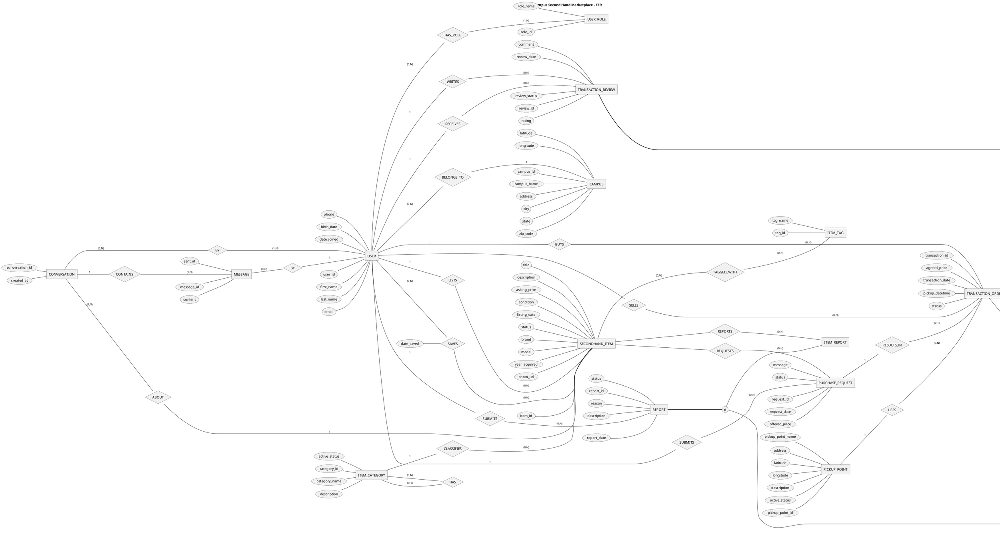

# Campus Secondhand Marketplace EER Diagram: PlantUML Version

This article converts the [original draw.io EER diagram](Seattle%20Campus%20Second%20Hand%20Market%20Place%20-%20EER%202.drawio) into editable PlantUML. It preserves the original entities, attributes, relationship names, cardinalities, and subtype constraints without adding database fields, data types, or foreign keys.

## Conversion Conventions

- Native Chen EER syntax starts with `@startchen`: `entity` renders as an entity rectangle, attributes render as ellipses, and `relationship` explicitly defines a relationship diamond. This is not a relational database schema.
- The connection labels `1`, `(0,1)`, `(0,N)`, and `(1,N)` correspond to the original `1..1`, `0..1`, `0..N`, and `1..N`, respectively, preserving the cardinality labels at each entity end.
- `SAVES` remains a many-to-many relationship between users and items. Its `date_saved` attribute is defined inside `relationship SAVES` and renders as an attribute ellipse connected to the relationship diamond.
- `=>= d` represents total, disjoint specialization, corresponding to the original diagram's `t` and `d`. Subtypes inherit their supertype's attributes; no additional IDs are introduced.
- Relationships with the same display name use distinct aliases. For example, `SUBMITS_REQUEST` and `SUBMITS_REPORT` both display as `SUBMITS` but represent separate relationship diamonds. In the recursive category relationship `CATEGORY_HAS`, the `(0,1)` end represents the parent category and the `(0,N)` end represents child categories.
- In the original file, the `item_id` connection is not bound to the item endpoint, and the order-to-`BUYER REVIEW` connection through `HAS` is not bound to the review endpoint. These connections are restored based on their drawn positions and the design notes. Two standalone cardinality labels at the item end are assigned to `TAGGED_WITH` (`0..N`) and `REQUESTS` (`1..1`). These adjustments restore drawing connections rather than introduce new business rules.

## Complete PlantUML

The following code defines a complete conceptual ER diagram. Render it with a recent PlantUML preview tool that supports Chen EER; a standard Markdown reader may display only the code. The `smetana` layout does not require an external Graphviz installation.

## Interpretation and Scope

All users are modeled as `USER`. Buyer and seller are transaction roles expressed through `BUYS` and `SELLS`, not user subtypes. Each order originates from one purchase request and has one buyer, one seller, and one pickup point. A request can produce at most one order. Each order can have at most one review of its buyer and one review of its seller.

`BUYER REVIEW` refers to a review of the buyer, and `SELLER REVIEW` refers to a review of the seller, not the author's role. Each report targets either one item or one transaction, never both. Only the buyer or seller of an order may submit a transaction report about that order.

Conversations concern specific items, with participation and message authorship modeled separately. The original cardinalities require at least one participant and at least one message per conversation. This version neither restricts participation to exactly two users nor permits empty conversations.

The original diagram does not define attribute data types, primary-key markers, or physical foreign keys, so this version does not infer them. Item reservations and cancellations, seller confirmation of completion, ownership of personal pickup locations, messaging permissions, and review eligibility remain implementation constraints. See the [EER design decisions](er-design-decisions.md) for details.